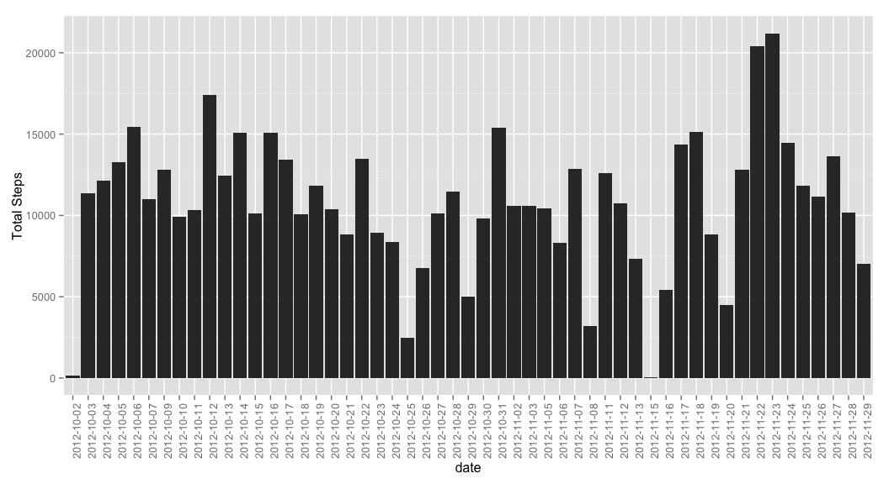
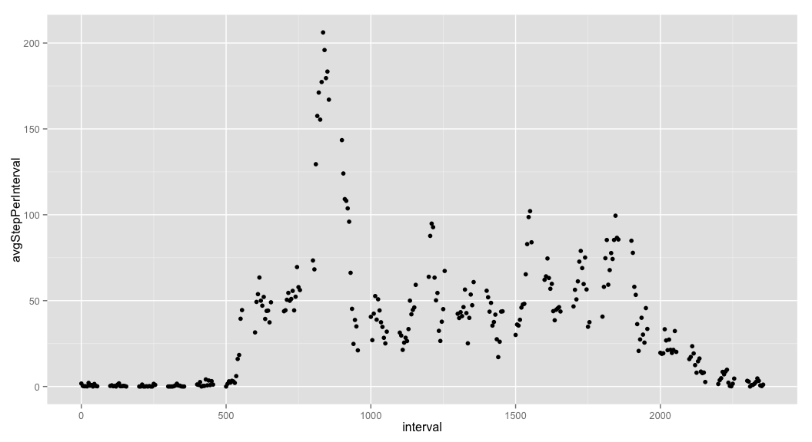
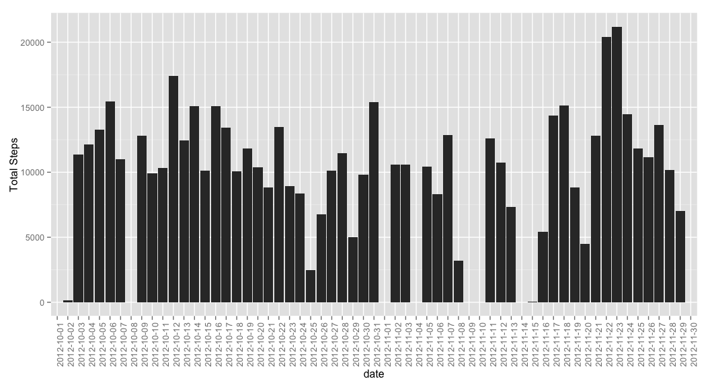
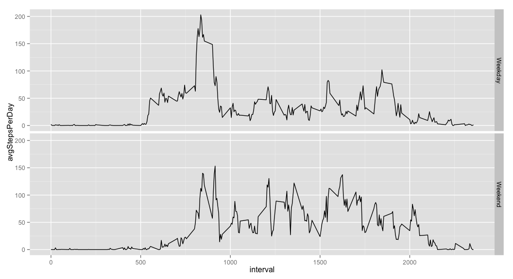

# Reproducible Research: Peer Assessment 1


## Loading and preprocessing the data
The data comes in a zip file, so we first need to download with method = "curl"
to download from a "https" link, then unzip, then load:

```r
library(ggplot2)
library(dplyr)

#downlaod the dataset, which comes as a zip
download.file("https://d396qusza40orc.cloudfront.net/repdata%2Fdata%2Factivity.zip", "CourseProject1_Dataset.zip", method = "curl")
unzip("CourseProject1_Dataset.zip")

#read in dataset
df.raw <- read.csv("activity.csv", header = T, sep = ",", na.strings = c(""))

#the following coercian is sloppy but prevents 0's from becoming 1's when
#converting a factor to numeric
df <- df.raw
df$steps <- as.numeric(as.character(df$steps))
df <- na.omit(df)
```
I seperate the raw dataset from the working dataset for the first few plots. I
chose this method because of the imputation task that comes later. This way I
don't need to re-download, yet I can still plot the first few analysis with a 
dataset I'm comfortable with.

I prefer ggplot2 and dplyr for this type of assignment, maybe its due to my love
of functional programming.

## What is mean total number of steps taken per day?
Pretty easy, plot hard and fast with qplot, and aggregate with dplyr summarise

```r
qplot(date, data=df, geom="bar", binwidth = 0.2,
      weight=steps, ylab = "Total Steps") + 
      theme(axis.text.x = element_text(angle = 90, hjust = 1))
```

 

```r
#print aggregated dataframe
print.data.frame(df %>% 
                     group_by(date) %>%
                     summarise(avgStepsPerDay = mean(steps, na.rm = T), 
                               medStepsPerDay = median(steps, na.rm = T)),
                 row.names = FALSE)
```

```
##        date avgStepsPerDay medStepsPerDay
##  2012-10-02      0.4375000              0
##  2012-10-03     39.4166667              0
##  2012-10-04     42.0694444              0
##  2012-10-05     46.1597222              0
##  2012-10-06     53.5416667              0
##  2012-10-07     38.2465278              0
##  2012-10-09     44.4826389              0
##  2012-10-10     34.3750000              0
##  2012-10-11     35.7777778              0
##  2012-10-12     60.3541667              0
##  2012-10-13     43.1458333              0
##  2012-10-14     52.4236111              0
##  2012-10-15     35.2048611              0
##  2012-10-16     52.3750000              0
##  2012-10-17     46.7083333              0
##  2012-10-18     34.9166667              0
##  2012-10-19     41.0729167              0
##  2012-10-20     36.0937500              0
##  2012-10-21     30.6284722              0
##  2012-10-22     46.7361111              0
##  2012-10-23     30.9652778              0
##  2012-10-24     29.0104167              0
##  2012-10-25      8.6527778              0
##  2012-10-26     23.5347222              0
##  2012-10-27     35.1354167              0
##  2012-10-28     39.7847222              0
##  2012-10-29     17.4236111              0
##  2012-10-30     34.0937500              0
##  2012-10-31     53.5208333              0
##  2012-11-02     36.8055556              0
##  2012-11-03     36.7048611              0
##  2012-11-05     36.2465278              0
##  2012-11-06     28.9375000              0
##  2012-11-07     44.7326389              0
##  2012-11-08     11.1770833              0
##  2012-11-11     43.7777778              0
##  2012-11-12     37.3784722              0
##  2012-11-13     25.4722222              0
##  2012-11-15      0.1423611              0
##  2012-11-16     18.8923611              0
##  2012-11-17     49.7881944              0
##  2012-11-18     52.4652778              0
##  2012-11-19     30.6979167              0
##  2012-11-20     15.5277778              0
##  2012-11-21     44.3993056              0
##  2012-11-22     70.9270833              0
##  2012-11-23     73.5902778              0
##  2012-11-24     50.2708333              0
##  2012-11-25     41.0902778              0
##  2012-11-26     38.7569444              0
##  2012-11-27     47.3819444              0
##  2012-11-28     35.3576389              0
##  2012-11-29     24.4687500              0
```

## What is the average daily activity pattern?
Similar to the previous task, this time just change the "group_by" call.
For the max just filter by max.

```r
#aggregate mean per day
df.dailyPatterns <- df %>%
                        group_by(interval) %>%
                        summarise(avgStepPerInterval = mean(steps, na.rm = T))

#Now plot
qplot(x = interval, y = avgStepPerInterval, data=df.dailyPatterns, geom = "point")
```

 

```r
#print the max average steps per day
df.dailyPatterns %>% filter(avgStepPerInterval == max(avgStepPerInterval))
```

```
## Source: local data frame [1 x 2]
## 
##   interval avgStepPerInterval
## 1      835           206.1698
```

## Imputing missing values
As with most tasks in R, there is a library and best practice for imputing,
here I'm using randomForest and na.roughfix function to impute. Na.roughfix
uses different methods depending on the class it receives. In this instance it
should use a median to impute, if given a factor it would choose to use a mode
function call to impute. Thus I expect several more "0"'s in the dataset; as you
can see above the median for just about every day is 0.

```r
#calculate and report the total number of NAs in the dataset
table(df.raw$steps)[["NA"]]
```

```
## [1] 2304
```

```r
#Impute missing values
library(randomForest)
df.imputed <- df.raw
df.imputed$steps <- as.numeric(as.character(df.imputed$steps))
df.imputed$steps <- na.roughfix(df.imputed$steps)

#Proof of Imputation
any(is.na(df.imputed$steps))
```

```
## [1] FALSE
```

```r
#remake plots with imputed df
qplot(date, data=df.imputed, geom="bar", binwidth = 0.2,
      weight=steps, ylab = "Total Steps") + 
      theme(axis.text.x = element_text(angle = 90, hjust = 1))
```

 

```r
print.data.frame(df.imputed %>% 
                     group_by(date) %>%
                     summarise(avgStepsPerDay = mean(steps, na.rm = T), 
                               medStepsPerDay = median(steps, na.rm = T)),
                 row.names = FALSE)
```

```
##        date avgStepsPerDay medStepsPerDay
##  2012-10-01      0.0000000              0
##  2012-10-02      0.4375000              0
##  2012-10-03     39.4166667              0
##  2012-10-04     42.0694444              0
##  2012-10-05     46.1597222              0
##  2012-10-06     53.5416667              0
##  2012-10-07     38.2465278              0
##  2012-10-08      0.0000000              0
##  2012-10-09     44.4826389              0
##  2012-10-10     34.3750000              0
##  2012-10-11     35.7777778              0
##  2012-10-12     60.3541667              0
##  2012-10-13     43.1458333              0
##  2012-10-14     52.4236111              0
##  2012-10-15     35.2048611              0
##  2012-10-16     52.3750000              0
##  2012-10-17     46.7083333              0
##  2012-10-18     34.9166667              0
##  2012-10-19     41.0729167              0
##  2012-10-20     36.0937500              0
##  2012-10-21     30.6284722              0
##  2012-10-22     46.7361111              0
##  2012-10-23     30.9652778              0
##  2012-10-24     29.0104167              0
##  2012-10-25      8.6527778              0
##  2012-10-26     23.5347222              0
##  2012-10-27     35.1354167              0
##  2012-10-28     39.7847222              0
##  2012-10-29     17.4236111              0
##  2012-10-30     34.0937500              0
##  2012-10-31     53.5208333              0
##  2012-11-01      0.0000000              0
##  2012-11-02     36.8055556              0
##  2012-11-03     36.7048611              0
##  2012-11-04      0.0000000              0
##  2012-11-05     36.2465278              0
##  2012-11-06     28.9375000              0
##  2012-11-07     44.7326389              0
##  2012-11-08     11.1770833              0
##  2012-11-09      0.0000000              0
##  2012-11-10      0.0000000              0
##  2012-11-11     43.7777778              0
##  2012-11-12     37.3784722              0
##  2012-11-13     25.4722222              0
##  2012-11-14      0.0000000              0
##  2012-11-15      0.1423611              0
##  2012-11-16     18.8923611              0
##  2012-11-17     49.7881944              0
##  2012-11-18     52.4652778              0
##  2012-11-19     30.6979167              0
##  2012-11-20     15.5277778              0
##  2012-11-21     44.3993056              0
##  2012-11-22     70.9270833              0
##  2012-11-23     73.5902778              0
##  2012-11-24     50.2708333              0
##  2012-11-25     41.0902778              0
##  2012-11-26     38.7569444              0
##  2012-11-27     47.3819444              0
##  2012-11-28     35.3576389              0
##  2012-11-29     24.4687500              0
##  2012-11-30      0.0000000              0
```

One difference is in the Average Steps per day; compare the imputed table
with the un-imputed table, this is due to an increase in the number of 0's in
the dataset due to the imputation performed. An increase of 2304 in the count of
0's to be exact; an identical number to the previous number of NA's, not by
coincidence. See this code:


```r
table(df.imputed$steps)[["0"]]
```

```
## [1] 13318
```

```r
table(df.raw$steps)[["0"]]
```

```
## [1] 11014
```

## Are there differences in activity patterns between weekdays and weekends?
Same methods just tweaking the existing code.

```r
#fix dates
df.imputed$date <- as.Date(df.imputed$date)

#create facet labels
df.weekday <- mutate(df.imputed, 
                     day = weekdays(date),
                     isWeekend = ifelse(day %in% c("Sunday", "Saturday")
                                        , "Weekend"
                                        , "Weekday"))

#aggregate using dplyr
df.weekday <- df.weekday %>%
    group_by(interval, isWeekend) %>% 
    summarise(avgStepsPerDay = mean(steps, na.rm = T))

#plot
qplot(x = interval, y = avgStepsPerDay
      , data = df.weekday, geom = "line"
      , facets = isWeekend ~ .)
```

 
