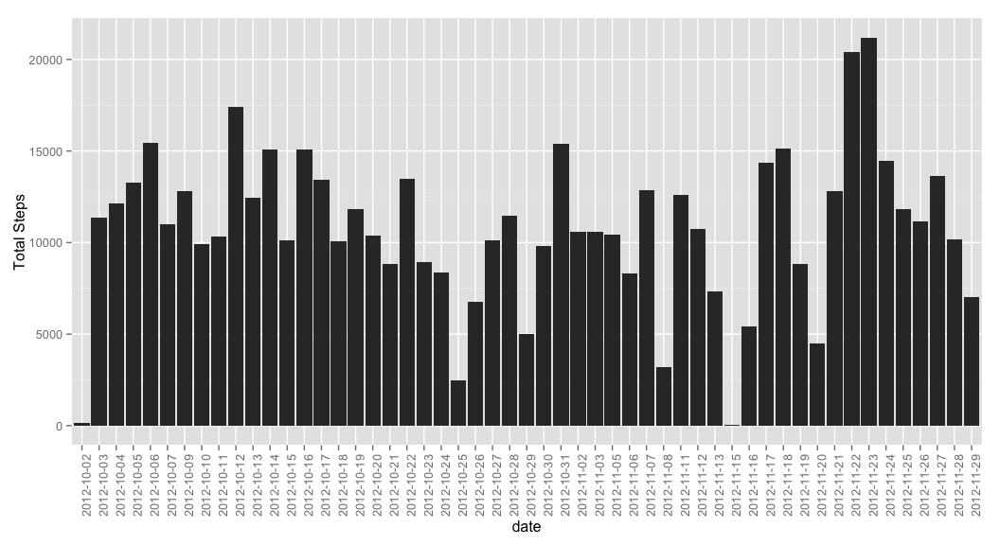
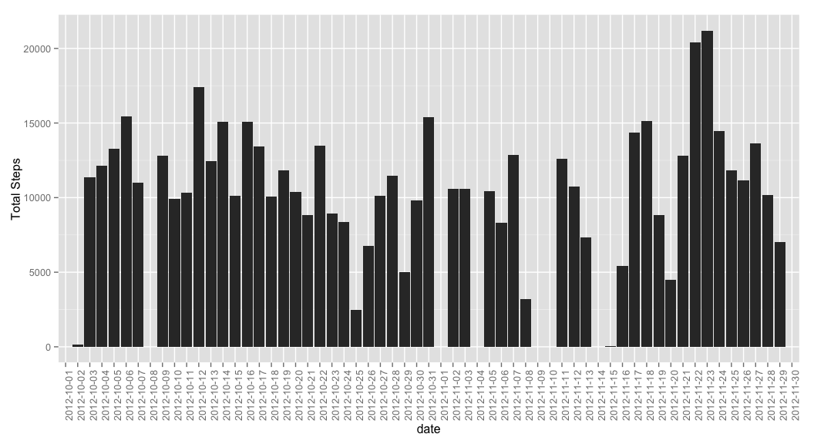
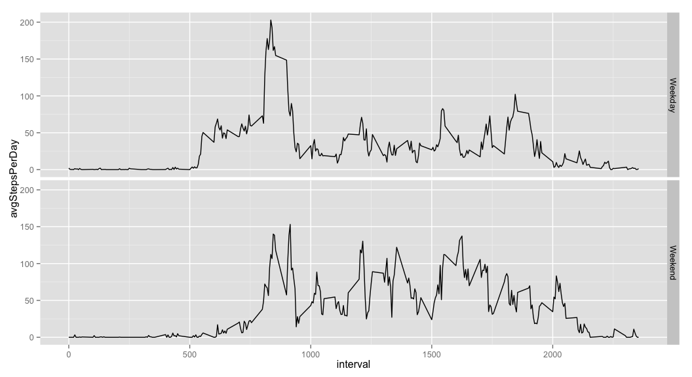

# Reproducible Research: Peer Assessment 1


## Loading and preprocessing the data

```r
library(ggplot2)
library(dplyr)
```

```
## 
## Attaching package: 'dplyr'
## 
## The following object is masked from 'package:stats':
## 
##     filter
## 
## The following objects are masked from 'package:base':
## 
##     intersect, setdiff, setequal, union
```

```r
download.file("https://d396qusza40orc.cloudfront.net/repdata%2Fdata%2Factivity.zip", "CourseProject1_Dataset.zip", method = "curl")
unzip("CourseProject1_Dataset.zip")
df.raw <- read.csv("activity.csv", header = T, sep = ",", na.strings = c(""))

#the following coercian is sloppy but prevents 0's from becoming 1's when
#converting a factor to numeric
df <- df.raw
df$steps <- as.numeric(as.character(df$steps))
```

```
## Warning: NAs introduced by coercion
```

```r
df <- na.omit(df)
```

## What is mean total number of steps taken per day?

```r
qplot(date, data=df, geom="bar", binwidth = 0.2,
      weight=steps, ylab = "Total Steps") + 
      theme(axis.text.x = element_text(angle = 90, hjust = 1))
```

 

```r
print.data.frame(df %>% 
                     group_by(date) %>%
                     summarise(avgStepsPerDay = mean(steps, na.rm = T), 
                               medStepsPerDay = median(steps, na.rm = T)),
                 row.names = FALSE)
```

```
##        date avgStepsPerDay medStepsPerDay
##  2012-10-02      0.4375000              0
##  2012-10-03     39.4166667              0
##  2012-10-04     42.0694444              0
##  2012-10-05     46.1597222              0
##  2012-10-06     53.5416667              0
##  2012-10-07     38.2465278              0
##  2012-10-09     44.4826389              0
##  2012-10-10     34.3750000              0
##  2012-10-11     35.7777778              0
##  2012-10-12     60.3541667              0
##  2012-10-13     43.1458333              0
##  2012-10-14     52.4236111              0
##  2012-10-15     35.2048611              0
##  2012-10-16     52.3750000              0
##  2012-10-17     46.7083333              0
##  2012-10-18     34.9166667              0
##  2012-10-19     41.0729167              0
##  2012-10-20     36.0937500              0
##  2012-10-21     30.6284722              0
##  2012-10-22     46.7361111              0
##  2012-10-23     30.9652778              0
##  2012-10-24     29.0104167              0
##  2012-10-25      8.6527778              0
##  2012-10-26     23.5347222              0
##  2012-10-27     35.1354167              0
##  2012-10-28     39.7847222              0
##  2012-10-29     17.4236111              0
##  2012-10-30     34.0937500              0
##  2012-10-31     53.5208333              0
##  2012-11-02     36.8055556              0
##  2012-11-03     36.7048611              0
##  2012-11-05     36.2465278              0
##  2012-11-06     28.9375000              0
##  2012-11-07     44.7326389              0
##  2012-11-08     11.1770833              0
##  2012-11-11     43.7777778              0
##  2012-11-12     37.3784722              0
##  2012-11-13     25.4722222              0
##  2012-11-15      0.1423611              0
##  2012-11-16     18.8923611              0
##  2012-11-17     49.7881944              0
##  2012-11-18     52.4652778              0
##  2012-11-19     30.6979167              0
##  2012-11-20     15.5277778              0
##  2012-11-21     44.3993056              0
##  2012-11-22     70.9270833              0
##  2012-11-23     73.5902778              0
##  2012-11-24     50.2708333              0
##  2012-11-25     41.0902778              0
##  2012-11-26     38.7569444              0
##  2012-11-27     47.3819444              0
##  2012-11-28     35.3576389              0
##  2012-11-29     24.4687500              0
```

## What is the average daily activity pattern?

```r
df.dailyPatterns <- df %>%
                        group_by(interval) %>%
                        summarise(avgStepPerInterval = mean(steps, na.rm = T))
qplot(x = interval, y = avgStepPerInterval, data=df.dailyPatterns, geom = "point")
```

 

```r
df.dailyPatterns %>% filter(avgStepPerInterval == max(avgStepPerInterval))
```

```
## Source: local data frame [1 x 2]
## 
##   interval avgStepPerInterval
## 1      835           206.1698
```

## Imputing missing values

```r
#calculate and report the total number of NAs in the dataset
sum(is.na(df.raw$steps))
```

```
## [1] 0
```

```r
#Impute missing values
library(randomForest)
```

```
## randomForest 4.6-10
## Type rfNews() to see new features/changes/bug fixes.
## 
## Attaching package: 'randomForest'
## 
## The following object is masked from 'package:dplyr':
## 
##     combine
```

```r
df.imputed <- df.raw
df.imputed$steps <- as.numeric(as.character(df.imputed$steps))
df.imputed$steps <- na.roughfix(df.imputed$steps)

#Proof of Imputation
any(is.na(df.imputed$steps))
```

```
## [1] FALSE
```

```r
#remake plots with imputed df
qplot(date, data=df.imputed, geom="bar", binwidth = 0.2,
      weight=steps, ylab = "Total Steps") + 
      theme(axis.text.x = element_text(angle = 90, hjust = 1))
```

 

```r
print.data.frame(df.imputed %>% 
                     group_by(date) %>%
                     summarise(avgStepsPerDay = mean(steps, na.rm = T), 
                               medStepsPerDay = median(steps, na.rm = T)),
                 row.names = FALSE)
```

```
##        date avgStepsPerDay medStepsPerDay
##  2012-10-01      0.0000000              0
##  2012-10-02      0.4375000              0
##  2012-10-03     39.4166667              0
##  2012-10-04     42.0694444              0
##  2012-10-05     46.1597222              0
##  2012-10-06     53.5416667              0
##  2012-10-07     38.2465278              0
##  2012-10-08      0.0000000              0
##  2012-10-09     44.4826389              0
##  2012-10-10     34.3750000              0
##  2012-10-11     35.7777778              0
##  2012-10-12     60.3541667              0
##  2012-10-13     43.1458333              0
##  2012-10-14     52.4236111              0
##  2012-10-15     35.2048611              0
##  2012-10-16     52.3750000              0
##  2012-10-17     46.7083333              0
##  2012-10-18     34.9166667              0
##  2012-10-19     41.0729167              0
##  2012-10-20     36.0937500              0
##  2012-10-21     30.6284722              0
##  2012-10-22     46.7361111              0
##  2012-10-23     30.9652778              0
##  2012-10-24     29.0104167              0
##  2012-10-25      8.6527778              0
##  2012-10-26     23.5347222              0
##  2012-10-27     35.1354167              0
##  2012-10-28     39.7847222              0
##  2012-10-29     17.4236111              0
##  2012-10-30     34.0937500              0
##  2012-10-31     53.5208333              0
##  2012-11-01      0.0000000              0
##  2012-11-02     36.8055556              0
##  2012-11-03     36.7048611              0
##  2012-11-04      0.0000000              0
##  2012-11-05     36.2465278              0
##  2012-11-06     28.9375000              0
##  2012-11-07     44.7326389              0
##  2012-11-08     11.1770833              0
##  2012-11-09      0.0000000              0
##  2012-11-10      0.0000000              0
##  2012-11-11     43.7777778              0
##  2012-11-12     37.3784722              0
##  2012-11-13     25.4722222              0
##  2012-11-14      0.0000000              0
##  2012-11-15      0.1423611              0
##  2012-11-16     18.8923611              0
##  2012-11-17     49.7881944              0
##  2012-11-18     52.4652778              0
##  2012-11-19     30.6979167              0
##  2012-11-20     15.5277778              0
##  2012-11-21     44.3993056              0
##  2012-11-22     70.9270833              0
##  2012-11-23     73.5902778              0
##  2012-11-24     50.2708333              0
##  2012-11-25     41.0902778              0
##  2012-11-26     38.7569444              0
##  2012-11-27     47.3819444              0
##  2012-11-28     35.3576389              0
##  2012-11-29     24.4687500              0
##  2012-11-30      0.0000000              0
```

One difference between the two datasets is in the number of 0's due to 
the randomForest package using **mode** to impute on the steps variable which is
considered a factor in the df.raw dataset. See this code:


```r
table(df.imputed$steps)[["0"]]
```

```
## [1] 13318
```

```r
table(df.raw$steps)[["0"]]
```

```
## [1] 11014
```

Another difference is in the Average Steps per day, compare the imputed table
with the un-imputed table.

## Are there differences in activity patterns between weekdays and weekends?

```r
#fix dates
df.imputed$date <- as.Date(df.imputed$date)

#create facet labels
df.weekday <- mutate(df.imputed, 
                     day = weekdays(date),
                     isWeekend = ifelse(day %in% c("Sunday", "Saturday")
                                        , "Weekend"
                                        , "Weekday")
)

#aggregate using dplyr
df.weekday <- df.weekday %>%
    group_by(interval, isWeekend) %>% 
    summarise(avgStepsPerDay = mean(steps, na.rm = T))

#plot
qplot(x = interval, y = avgStepsPerDay
      , data = df.weekday, geom = "line"
      , facets = isWeekend ~ .
      )
```

 
